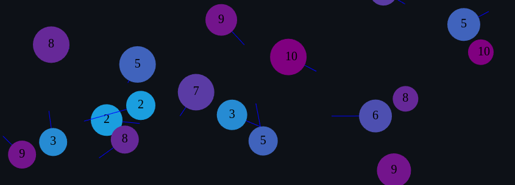

# Ball Physics implemented in HTML5 Canvas

Simple vanilla implementation of some basic physics for ball collisions:

- Ball to ball collision
- Ball to wall collision

Heavily inspired by:

- [this](https://www.youtube.com/playlist?list=PLo6lBZn6hgca1T7cNZXpiq4q395ljbEI_) youtube playlist made by [danielstuts](https://www.youtube.com/@danielstuts3129), implementing what i did and much more.
- [this](https://www.youtube.com/watch?v=eED4bSkYCB8) awesome video from [Reducible](https://www.youtube.com/@Reducible), giving an overview of collision detection methods with great visuals.
